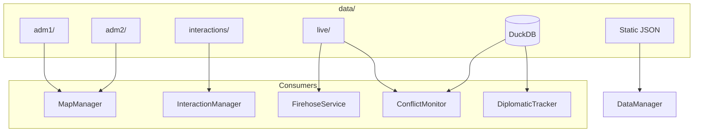

# Data

Central data directory for GDELT-Streamer. Contains GeoJSON boundaries, interactions manifest, live ingestion output, static config, and DuckDB databases.

## Layout Overview

---

## adm1/, adm2/

GeoJSON files by country ISO code (e.g., USA.geojson, IND.geojson). adm1 holds first-level administrative divisions (states/provinces); adm2 holds second-level (districts). MapManager loads these on drill-down: world → adm1 when a country is clicked, adm2 when a state is clicked. Lazy-loaded to keep initial payload small.

---

## interactions/

**manifest.json** – Index of all interactions. Version 3.0 format: categories (disputes, meetings, agreements, etc.), byCategory (list of IDs per category), interactionsById (full entries with name, participants, description, sources, etc.). Written by manifest_writer and rebuild_manifest.

**Category subdirs** – disputes, meetings, agreements, trade, military, humanitarian, cultural, other. Each contains per-interaction JSON files (id.json). Full detail including optional llm_analysis, sources. Lazy-loaded for analysis.

**raw_llm_events.json** – Raw events from LLM source. Processed by manifest_auto_updater run_update_from_files.

**raw_news_events.json** – Raw events from news scraper. Written by news_scraper; processed by run_update_from_files.

**cache/** – Subdirs for article cache and llm_analysis cache.

---

## live/

**gdelt_latest.json** – Latest GDELT GeoJSON FeatureCollection. Written by FirehoseService and gdelt_firehose. Served by /api/live.

**gdelt_window.json** – Rolling history window (configurable hours). Same structure; used for hotspot analysis and historical queries.

**hotspots_latest.json** – Output of HotspotAnalyzer. Location/event/actor clusters with counts and top_sources. Consumed by gdelt_event_aggregator.

**alerts_latest.json** – High-severity alerts from conflict/diplomacy processing. Persisted by AlertingService.

**cast_forecasts.json** – ACLED CAST forecast cache by country:year. Written by AcledService.

**gdelt_anomaly_baseline.json** – Baseline for anomaly detection in HotspotAnalyzer.

---

## Static Files

**countries.geojson** – World boundaries (L0). Loaded by MapManager on init.

**country_info.json** – Country metadata (name, neighbors, etc.). Loaded by DataManager.

**country_sources.json** – Data source config per country.

**capitals.json** – Capital coordinates (country and adm1). Built by update_geo_data. Used for coords lookup.

**currency_rates.json** – Exchange rates (1 foreign = X INR). Built by update_currency_data.

**volatile_data.json** – Dynamic country data (population, GDP, leaders). Built by update_volatile_data.

---

## DuckDB

**gdelt_conflicts.duckdb** – ConflictMonitor tables: conflict_events, casualty_counts. Stores protest/violence/coercion events with severity, actors, location.

**gdelt_diplomacy.duckdb** – DiplomaticRelationsTracker tables: country_interactions, bilateral_relations. Stores bilateral events and relation metrics.

**test_conflicts.duckdb**, **test_diplomacy.duckdb**, **test_integration_*.duckdb** – Test databases. Used by integration tests with isolated paths.

---

## adm_lookup.json

Place name → coordinates lookup for Wikipedia API. Built by build_adm_lookup. Used when /api/wikipedia/lookup is called without lat/lon; provides coords for geosearch fallback.
