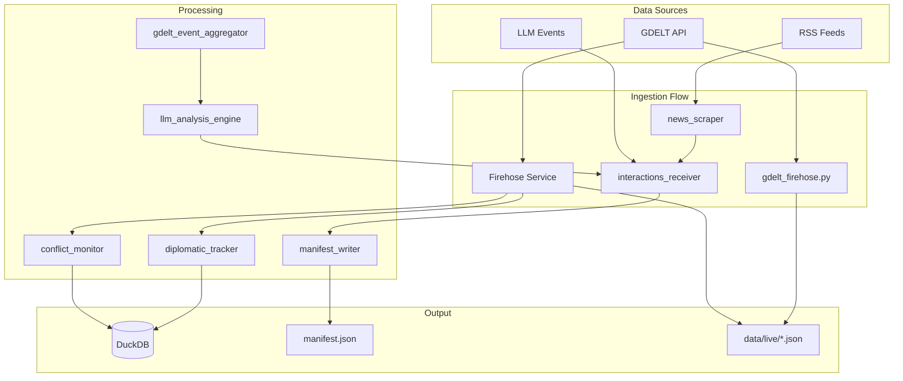
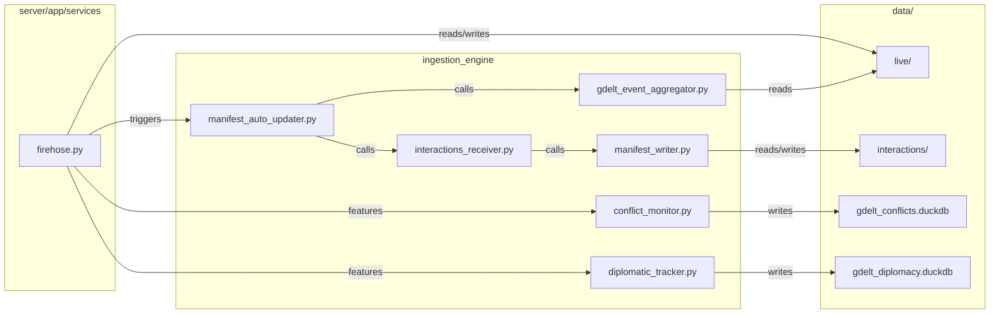

# Ingestion Engine

Data ingestion pipeline for GDELT events, interactions, and auxiliary data. Handles GDELT streams, conflict/diplomacy analytics, interactions manifest, and maintenance tasks.

## Logic Flow Overview

## File Communication

---

## Top-Level Scripts

### orchestration.py

Optional Prefect orchestration layer. When Prefect is installed, defines a flow with tasks: ingest GDELT via FirehoseService, analyze patterns via HotspotAnalyzer, detect anomalies and send alerts, process conflict events via ConflictMonitor, process diplomatic relations via DiplomaticTracker. Runs on an interval schedule (15 minutes). When Prefect is unavailable, falls back to direct execution: runs FirehoseService fetch cycle once.

### conflict_monitor.py

Receives GeoJSON feature collections (from FirehoseService or orchestration). Categorizes events by GDELT event root codes: PROTEST (14xx), VIOLENCE (18/19/20), COERCION (17). Filters events matching these categories. Computes severity score from Goldstein scale, mentions, and sources. Stores filtered events into DuckDB (conflict_events, casualty_counts tables). Detects high-impact events using 90th-percentile threshold or fixed criteria (NumSources > 20, Goldstein < -8, EventRootCode 20). Generates alerts for high-impact events. Exposes query methods: query_protests, query_mass_casualty, query_hotspots.

### diplomatic_tracker.py

Filters events to bilateral only (both actor1countrycode and actor2countrycode present and distinct). Categorizes interactions: diplomatic (01–09), military (15–20), economic (061, 07), conflict (18–20). Stores country_interactions and bilateral_relations in DuckDB. Computes relation metrics per country pair: cooperation/conflict counts, avg Goldstein, relation trend (improving/stable/deteriorating). Detects significant developments (high sources, high Goldstein magnitude, critical event codes). Tracks war indicators (threat score, military posture, active conflict). Exposes query_network_centrality and query_conflict_pairs.

---

## streamers/

### gdelt_firehose.py

Standalone script. Fetches lastupdate.txt from GDELT, parses export and mentions URLs. Downloads mentions CSV first to build event ID → URL map. Downloads and parses export CSV; maps event codes via taxonomy; attaches multi-link sources from mention map. Optionally processes GKG CSV for count-type events (KILL, WOUND, ARREST, PROTEST, etc.). Merges with existing features from data/live/gdelt_latest.json; prunes old events by date; deduplicates by event_sig or eventid. Writes combined features to data/live/gdelt_latest.json.

### cast_probe.py

Probe/utility for CAST-related functionality.

### taxonomy.py

Maps GDELT event codes to categories (CONFLICT, VIOLENCE, PROTEST, etc.) and colors. Used by gdelt_firehose and server firehose for consistent categorization.

---

## services/

### interactions_receiver.py

Single entry point for events from any source. Accepts events and source tag (llm, news_scraper, gdelt, gdelt_conflict, gdelt_diplomatic, etc.). Normalizes per source: normalize_llm, normalize_news_scraper, normalize_gdelt produce canonical schema (name, participants, category, subtype, visualization_type, arc_style, source_urls, etc.). Validates required fields and allowed enum values. Delegates to legacy_processors manifest_writer process_new_events. Returns count of added events and validation errors.

### manifest_auto_updater.py

Two entry points. run_update_from_files: loads raw_llm_events.json and raw_news_events.json from data/interactions; passes events to interactions_receiver with appropriate source. run_update_gdelt: runs gdelt_event_aggregator to collect events from hotspots, anomalies, conflict, diplomacy; optionally limits count; runs llm_analysis_engine to enrich with analysis; passes enriched events to interactions_receiver with source gdelt. Can be triggered by API or firehose when GDELT_INTERACTIONS_ON_FIREHOSE is set.

### gdelt_event_aggregator.py

Collects events from multiple outputs: hotspots_latest.json (location/event/actor clusters with top_sources), anomalies, conflict monitor high-impact, diplomatic tracker significant/escalation. Builds canonical event records with id, type, participants, location, description, confidence, source_urls. Confidence derived from source count and event count. Output format compatible with LLM analysis and interactions receiver.

### gdelt_link_extractor.py

Extracts source URLs from GDELT event data for use in article fetching and LLM context.

### article_fetcher.py

Fetches full-text content from URLs. Caches by URL hash in data/interactions/cache/articles. Tries readability first, falls back to BeautifulSoup extraction. Returns text excerpts for LLM analysis. Used by llm_analysis_engine.

### llm_analysis_engine.py

Combines GDELT event data and article content into refined analysis. Calls OpenRouter or Groq API with structured prompt. Prompt instructs LLM to output JSON: analysis, visualization_type (geodesic vs dot), arc_style, location, toast_message, toast_type, confidence. Uses participant count to decide geodesic (2+ countries) vs dot (single location/actor). Caches results by event signature. Supports lazy analysis and batch processing. Used by manifest_auto_updater and API lazy-load endpoint.

### news_scraper.py

Fetches RSS feeds from config; parses entries; fetches full text via newspaper3k/readability. Infers category and subtype from title/description (agreements, meetings, humanitarian, disputes, etc.). Builds events with name, participants (from countries field), source URLs. Writes to raw_news_events.json. Can be run via API /api/interactions/run-news-scraper.

### wikipedia_fetcher.py

Fetches Wikipedia pages by title or geosearch. Used by server API for Wikipedia lookup and side panel content.

---

## gkg_pipeline/

### fetch_gdelt.py

Reads config.yaml for GDELT base URL and paths. Fetches lastupdate.txt, locates gkg.csv.zip URL. Downloads and extracts to raw GKG directory. Fetches daily gkgcounts file (yesterday by default) from gkgcounts URL; downloads zip or CSV fallback; saves to raw counts directory.

### process_data.py

Reads gkgcounts CSV (tab-separated, date, num_sources, count_type, number, etc.). Filters by configured metric types (e.g., KILL, INJURED, DISPLACED, PROTEST). Aggregates by date+country and date+country+admin1. Inserts into DuckDB gdelt_metrics and gdelt_admin1_metrics. Emits processed CSVs to processed directory.

### retention_cleanup.py

Retention and cleanup logic for GKG pipeline data.

### update_pipeline.py

Pipeline orchestration for GKG updates.

---

## maintenance/

### rebuild_manifest.py

Walks data/interactions/{category}/*.json. Loads each JSON, extracts id, name, category, subtype, participants, description, sources, etc. Builds manifest v3.0 with byCategory (lists of IDs per category) and interactionsById (full entries). Writes manifest.json. Run after manual edits or migration.

### update_geo_data.py

Fetches capital coordinates via Wikidata SPARQL. First query: countries with ISO3 and capital coords. Second query per country: first-level admin divisions with capitals. Builds data/capitals.json with country and state-level capital lat/lng.

### update_currency_data.py

Fetches currency rates from Frankfurter API (primary) and fawazahmed0 (secondary). Converts to 1 foreign unit = X INR. Writes data/currency_rates.json. Intended for cron (e.g., every 12 hours).

### update_volatile_data.py

Fetches REST Countries (population, area, gini), World Bank (GDP), and uses curated CURRENT_LEADERS dict. Builds data/volatile_data.json with country-level dynamic data. Run periodically (weekly/monthly).

### migrate_manifest_v3.py

Migrates older manifest formats to v3.0 (byCategory, interactionsById).

### retag_gdelt_interactions.py

Retags GDELT-sourced interactions (e.g., category/subtype corrections).

---

## legacy_processors/

Decoupled collection from processing. Collectors fetch raw strings; processors clean and write.

**collectors/rss_collector.py**: Fetches RSS; saves raw data before processing.

**processors/deduplicator.py**: Deduplicates events by signature.

**processors/geocoder.py**: Geocodes place names to coordinates.

**processors/manifest_writer.py**: Loads manifest, ensures categories and structure. For each new event: geocodes if needed, deduplicates, assigns category (with fallbacks), writes per-interaction JSON to category subdir, updates manifest byCategory and interactionsById. Called by interactions_receiver.

---

## archive/

Deprecated collectors and scripts. llm_collector, rss_collector, build_adm_lookup, download_full, download_wiki_data, extract_disputes. Kept for reference; superseded by current services and maintenance scripts.
