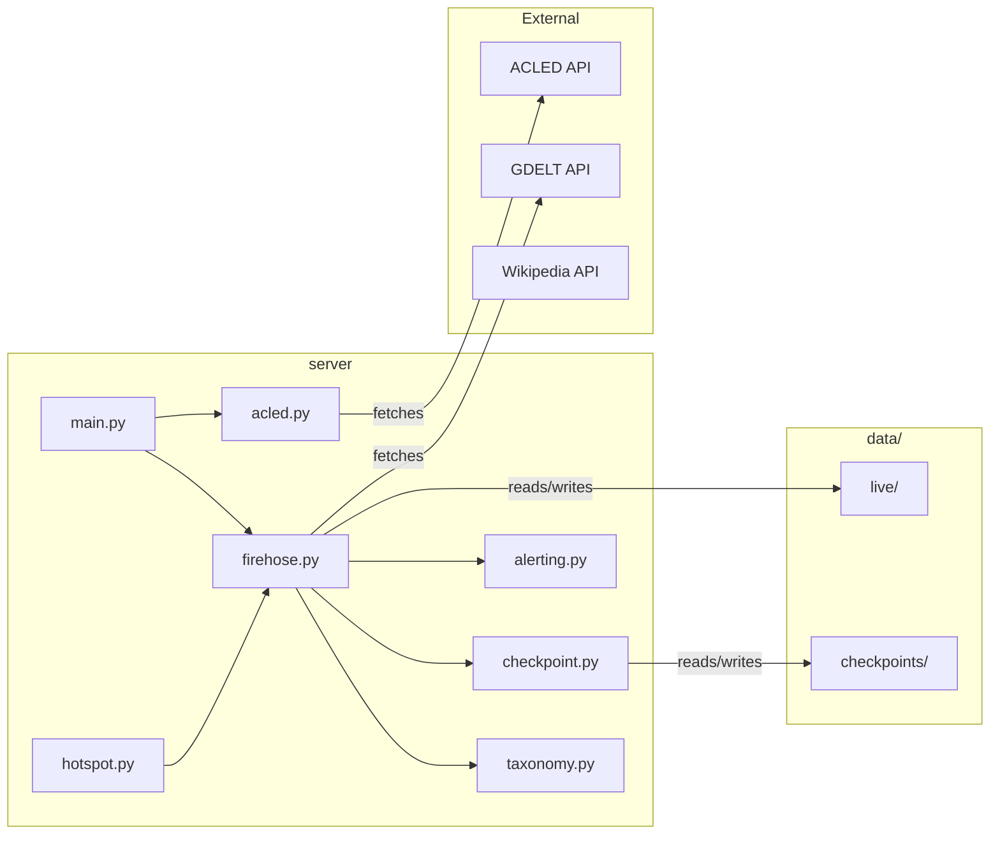

# Server

FastAPI backend for GDELT-Streamer. Serves live GDELT data, interactions, Wikipedia lookup, ACLED CAST forecasts, and orchestrates firehose ingestion.

## Logic Flow Overview

```mermaid
flowchart TB
    subgraph client [Frontend]
        DataManager[DataManager.js]
    end

    subgraph main [main.py]
        FastAPI[FastAPI App]
        Startup[startup_event]
    end

    subgraph services [app/services]
        Firehose[FirehoseService]
        Acled[AcledService]
        Checkpoint[CheckpointManager]
        Alerting[AlertingService]
        Hotspot[HotspotAnalyzer]
    end

    subgraph routes [Routes]
        Live[/api/live]
        Cast[/api/cast]
        Health[/api/health]
        Interactions[/api/interactions/*]
        Wikipedia[/api/wikipedia/*]
    end

    FastAPI --> Startup
    Startup --> Firehose
    Firehose -->|start| Firehose
    DataManager --> Live
    DataManager --> Cast
    Live --> Firehose
    Cast --> Acled
    Firehose --> Checkpoint
    Firehose --> Alerting
```

## File Communication



---

## Architecture

main.py wires CORS middleware, loads .env secrets, instantiates FirehoseService and AcledService. On startup, calls firehose.start() to begin the background fetch loop. All routes are defined in main.py; interactions and Wikipedia logic use inline helpers or lazy imports from ingestion_engine.

---

## Routes

### Health and Status

- **GET /** – Simple message and endpoint list.
- **GET /api/health** – Returns status ok and firehose_running. Used by frontend to wait for backend readiness.

### Live Data

- **GET /api/live** – Returns FirehoseService.latest_data (in-memory GeoJSON FeatureCollection). Frontend polls every 15 seconds.

### ACLED CAST

- **GET /api/cast?country=&admin1=&year=** – Returns CAST forecast for country/region. AcledService checks cache by country:year; on miss, fetches from ACLED API with OAuth. Optional admin1 filters results.

### Interactions

- **GET /api/interactions/{id}/analysis** – Lazy-load LLM analysis. Looks up interaction in manifest, checks for cached analysis in detail file. If missing: fetches articles, runs llm_analysis_engine, caches result in detail file and manifest, returns analysis.
- **POST /api/interactions/process-gdelt** – Runs manifest_auto_updater.run_update_gdelt (aggregator → LLM → receiver).
- **POST /api/interactions/ingest** – Body: { events, source }. Passes to interactions_receiver.receive_events.
- **POST /api/interactions/run-news-scraper** – Runs news_scraper, then run_update_from_files for raw_news_events.
- **GET /api/interactions/status** – Manifest existence, last_updated, total_entries.

### Wikipedia

- **GET /api/wikipedia/page?title=** – Fetch page by title; returns title, url, extract, thumbnail, pageid.
- **GET /api/wikipedia/geosearch?lat=&lon=&radius=&limit=** – Geosearch near coordinates.
- **GET /api/wikipedia/lookup?place=&lat=&lon=&iso=** – Best-match: title first, else geosearch. Uses adm_lookup.json for coords when lat/lon missing.
- **GET /api/wikipedia/html?title=** – Mobile-sections HTML for side panel embedding.

---

## app/services/

### firehose.py

FirehoseService maintains in-memory latest_data and history_data (rolling window). On start, runs initial _fetch_cycle, then spawns daemon thread that calls _fetch_cycle every 15 minutes. Fetch cycle: GET lastupdate.txt, parse export and mentions URLs; skip if URL already seen; download mentions CSV, build event ID → URLs map; download export CSV, parse rows via taxonomy (GDELT_MAPPING); attach sources from mention map; filter by category (drop OTHER); update latest_data and history_data (prune older than GDELT_HISTORY_HOURS); call _process_conflicts and _process_diplomacy; optionally _trigger_interactions_update if env set; persist to gdelt_latest.json and gdelt_window.json; save checkpoint. Exposes get_history(hours, transnational) for filtered historical events.

### checkpoint.py

CheckpointManager stores JSON state at checkpoints/pipeline_state.json. save_checkpoint writes last_timestamp, processed_count, metadata. load_checkpoint returns last timestamp or default (1 day ago). get_state returns full state dict. Used by firehose for resumption and by orchestration.

### alerting.py

AlertingService sends alerts above severity threshold to Telegram and Discord webhooks (from env). Receives list of alerts; filters by alert_threshold; formats message; sends via webhooks; persists high-severity to data/live/alerts_latest.json. Called by firehose after conflict_monitor and diplomatic_tracker produce alerts.

### hotspot.py

HotspotAnalyzer takes FirehoseService instance. analyze() splits history into current and previous windows; optionally filters transnational only; clusters by grid (grid_km) or DBSCAN; scores locations, events, actors by weighted count and trend; returns hotspots and methodology. detect_anomalies() compares current to baseline; uses sigma threshold. Used by orchestration and e2e tests.

### acled.py

AcledService manages OAuth token for ACLED API. get_forecast(country, admin1, year) checks cache (country:year); on miss, fetches via _fetch_live_cast; caches and persists to data/live/cast_forecasts.json. Returns list of forecast entries.

---

## app/core/

### taxonomy.py

GDELT_MAPPING (event code → category), THEME_MAPPING, COLORS. Imported by firehose and ingestion_engine streamers for consistent categorization.
