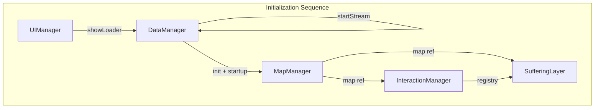

# Source (Frontend)

Vanilla JavaScript frontend with Leaflet map. Displays hierarchical administrative boundaries, live GDELT events, interactions (geodesic arcs), CAST forecasts, and suffering/live tracker layer.

## Logic Flow Overview



## File Communication

```mermaid
flowchart LR
    subgraph src [src]
        Main[main.js]
        DataManager[DataManager.js]
        MapManager[MapManager.js]
        UIManager[UIManager.js]
        InteractionManager[InteractionManager.js]
        SufferingLayer[SufferingLayer.js]
    end

    subgraph api [Backend API]
        Live[/api/live]
        Cast[/api/cast]
        Health[/api/health]
    end

    subgraph data [Static Data]
        GeoJSON[countries.geojson]
        Manifest[manifest.json]
        Config[country_info, volatile_data, etc.]
    end

    Main --> DataManager
    Main --> MapManager
    Main --> UIManager
    Main --> InteractionManager
    Main --> SufferingLayer
    DataManager --> Live
    DataManager --> Cast
    DataManager --> Health
    DataManager --> Config
    MapManager --> GeoJSON
    InteractionManager --> Manifest
    MapManager --> UIManager
    InteractionManager --> UIManager
```

---

## Entry Point: main.js

Async IIFE on load. Creates UIManager, shows loader. Initializes DataManager: init (load static JSON) and startup (waitForBackend, waitForLiveData with retries). Calls dataManager.startStream (polls /api/live every 15s). Creates MapManager with map div, DataManager, UIManager; init loads world GeoJSON and renders. Creates InteractionManager with map, DataManager, UIManager; init loads manifest and renders arcs. Creates SufferingLayer with map, DataManager, UIManager, InteractionManager; init adds toggle and listeners. Exposes window.app with all managers for debugging. On failure, hides loader and shows error overlay.

---

## DataManager.js

Central data broker. Constructor initializes cache, countrySources, geoData, countryInfo, volatileData, currencyRates, capitalData. init() fetches country_sources.json, country_info.json, volatile_data.json, currency_rates.json, capitals.json in parallel. startup(onStatus) waits for backend health (/api/health) and live data (/api/live) with configurable retries. startStream() fetches once then setInterval 15s to poll /api/live; updates geoData. fetchData() assigns response to geoData. getCastForecast(countryName, admin1) calls /api/cast with query params. fetchJSON handles URL and caching. Used by MapManager for geo and CAST, by UIManager for country info, by SufferingLayer for live events.

---

## MapManager.js

Leaflet map controller. Constructor stores mapId, dataManager, uiManager; navStack for breadcrumbs; ZOOM_THRESHOLDS for level transitions. Listens to cast-tab-visibility and cast-data-update for CAST choropleth; map-level-change to clear or apply choropleth. init() creates L.map, tile layer, loads countries.geojson, calls renderLayer(worldData, 0), renderBreadcrumb. renderLayer switches by level: 0 world, 1 adm1, 2 adm2; loads adm1/{ISO}.geojson or adm2/{ISO}.geojson on drill. Handles click: zoom and load child boundary; dispatches map-level-change. Breadcrumb shows current path; click navigates back. applyCastChoropleth colors polygons from CAST data when on level 1; clearCastChoropleth removes styling.

---

## InteractionManager.js

Manages geodesic arcs and interaction layer. Constructor stores map, dataManager, uiManager; layers (category → L.layerGroup); COUNTRY_COORDS lookup. Listens to open-panel (shows dispute panel for interaction ID); click on popup-btn dispatches open-panel. Listens to map-level-change to updateVisibility. init() loads manifest.json; creates interactionPane; for each category, creates layer group; iterates items, renders each via renderInteraction (visual line + hit line, geodesic arc); builds registry and categoryData; renderPanelControls; updateInteractionVisibility. renderInteraction creates arc from participants coords; ghost line technique: thin visible + thick invisible for click target. getInteractionByDescription searches registry by name/description. updateVisibility shows/hides layer groups by map level and filter state.

---

## UIManager.js

UI state and helpers. Constructor sets activeTab, RELIGION_COLORS. initEventListeners wires tab clicks and close button. showLoader/hideLoader/setLoaderProgress control startup loader. toast(msg, type) creates transient notification. $(id) returns document.getElementById. escapeHtml and formatAnalysisHtml for safe HTML. switchTab updates active tab and content. showDisputePanel(item, getCountryInfo) populates side panel with interaction details; fetches Wikipedia, CAST, LLM analysis on demand; handles Info/Wikipedia/CAST tabs. Handles panel close and popup interactions.

---

## SufferingLayer.js

Live event tracker overlay. Constructor stores map, dataManager, uiManager, interactionManager; layerGroup; createPulseIcon for markers. init() creates sufferingPane (z-index above interactions); renderControl adds toggle and filter dropdown; listens to live-tracker-region-change (regionGeometry update); setInterval 5 min refresh when visible. toggle(on) fetches live events for current region; filters by mode (smart vs all); renders pulse markers. Smart filter declutters overlapping events. Listens to map/view changes to refresh when region changes.
